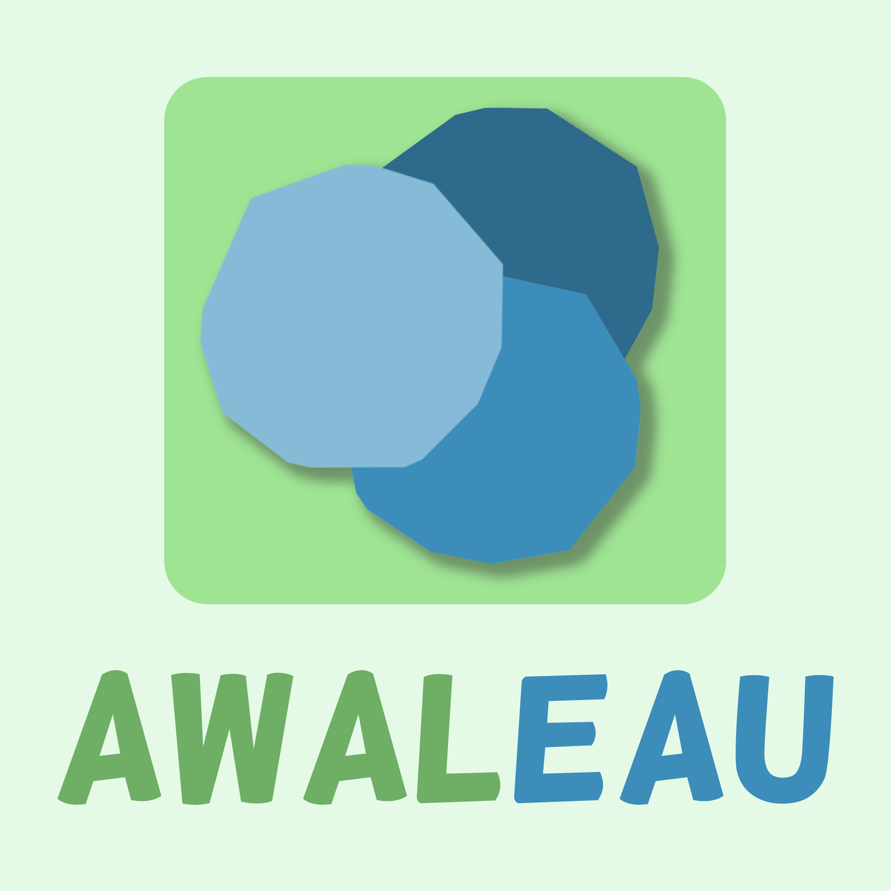

Ce dépôt contient les sources du projet tuteuré de Semestre 3 de DUT Informatique à l'IUT Montpellier-Sète (IUTMS) lors de l'année 2021-2022.
<div align="center">
	
	<h3 align="center">PROJET TUTORE AWALE SEMESTRE 3</h3>
</div>

## I - Déploiement
### Prérequis
- Git
- Docker (+ Docker-compose)
### Installation
Suivez ces étapes pour installer le jeu en local :

```
git clone <lien vers le projet>
cd <dossier du projet>
docker-compose build
docker-compose up -d
```

Vous pouvez maintenant y accéder ici : [localhost:8080](http://localhost:8080/)

## II - Liens utiles :
- [Règles du jeu](https://www.regledujeu.fr/awale/)
- [Docs Spring Boot](https://docs.spring.io/spring-boot/docs/current/reference/htmlsingle/)
- [Docs Docker](https://docs.docker.com/)

## III - Objectif :
L'Awalé est un jeu de société combinatoire abstrait créé en Afrique qui se joue à deux joueurs. Le but du jeu est d'avoir récupéré le plus de graines à la fin de la partie. L'objectif de ce projet est de programmer ce jeu.

Ce projet Java/Web consistait à programmer une solution informatique permettant à un joueur de jouer contre un autre joueur ou contre une IA (naïve ou intelligente) en réseau.

## IV - Techonologies utilisées pendant le projet :
- **Backend :** Java (+ Spring Boot)\
- **Frontend :** PHP, JavaScript\
- **Déploiement :** Docker\
- **Logiciel utilisé pour l'UML :** StarUML

[Détail sur les endpoints du serveur](./endpoints.md)

## V - Collaborateurs
- [Axelle Donot](https://github.com/Axelle-Donot)
- [Inès Garcia](https://github.com/Ines-Garcia)
- [Matéo Fernandez](https://github.com/mateo-fernandez)
- [Matthieu Dano](https://github.com/matthieu-dano)
- Tutrice : Gaëlle Hisler
